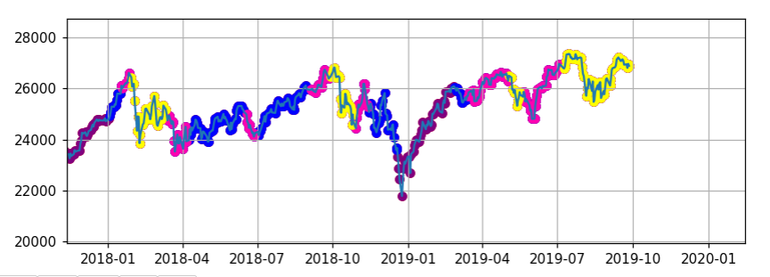
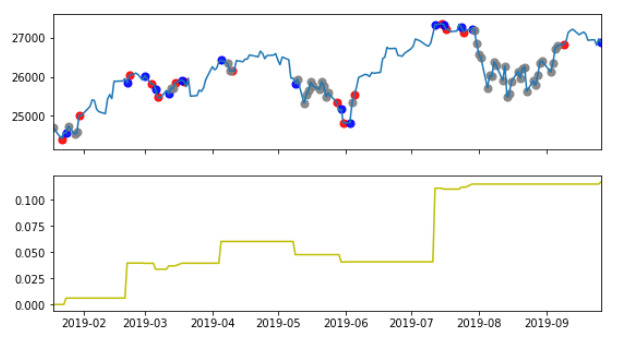
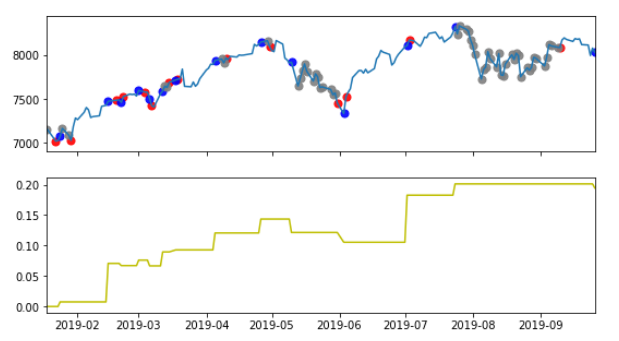
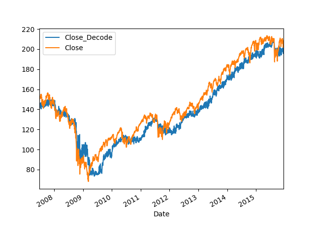
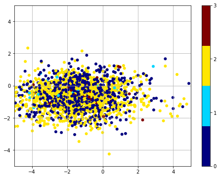
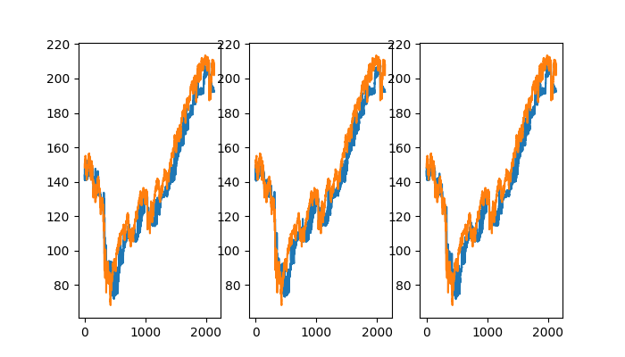

# Economic Review with Reinforcement learning ,Variation Autoencoder and Machine Learning
## 2019-09-27 All Dow,SPY,IXIC In Sell Signal

## This is deep learning analysis of Dow index about anomaly detection and reinforcement_learning for how to decide the trading

- Today Dow index is in the same status as 95% anomaly , that means Dow and other major index is still in dangerous level

### 2019-09-27 DJI
  

### 2019-09-27 SPY
- DJI  
  
- IXIC  
  

- Today DJI,IXIC generates the __Sell signal__, starts the short position slowly

## Variational Autoencoder

### time series data  
- data generation from variation autoencoder  

### data mapping
- stock data 0: none 1: buy signal 2: hold 3: sell  
- mapping stock signal into the latent space  

### generated results from the same input stock data  

